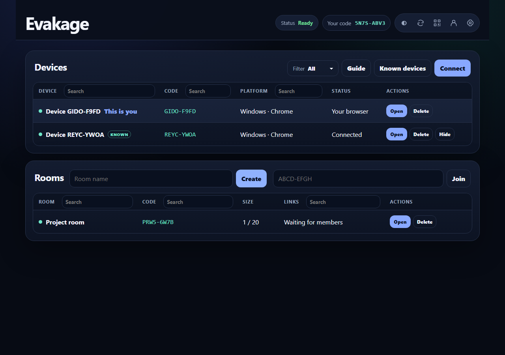

# Evakage

Self-hosted **temporary, end-to-end encrypted chat and file sharing** for trusted networks.
Connect devices by private code or QR, send text and files directly, or invite a
small group into a temporary room. Use it in your browser or install it as a web app (PWA).

[Documentation](https://evakage.docs.thesteau.com) ·
[Buy me a coffee](https://buymeacoffee.com/thesteau)



## Quick start

With Docker installed, save this as `docker-compose.yml` in a directory of your
choice. It matches the [current deployment Compose file](deploy/docker-compose.yml):

```yaml
services:
  evakage:
    image: ghcr.io/thesteau/evakage:latest
    container_name: evakage
    restart: unless-stopped
    ports:
      - "3712:3000"
    env_file: .env
    volumes:
      - account-data:/home/node/evakage-accounts

volumes:
  account-data:
```

The Compose setup is ready to use and loads your settings through `env_file: .env`.
Environment settings can change between releases, so check the current
[`.env.example`](deploy/.env.example) for available variables and default values
before deploying or updating. When updating, merge relevant changes into your
existing `.env`, keeping your own values.

Create a `.env` file beside it (it can be empty for the defaults), then run these
commands from that directory:

```bash
touch .env
docker compose pull
docker compose up -d
```

Open `http://localhost:3712`. See [the deployment guide](https://evakage.docs.thesteau.com/hosting/deployment) for
configuration, updates and account backups. `latest` tracks tested `main`
builds; pin an available `vX.Y.Z` tag when you need a stable version.

To use other devices, put the app behind an HTTPS
reverse proxy with a trusted certificate. In the `.env` file beside your Compose
file, set `TRUST_PROXY=1` only when using a proxy you control. HTTPS or localhost
is required for browser encryption and web app features.

## Using Evakage

If someone already hosts an instance for you, open its URL in both browsers.
On one device, choose the **QR icon** next to **Connect** in **Devices** to show
its QR invitation and private pairing code. On the other device, choose
**Connect**, then scan the QR code or enter the private code and choose **Join**.
Choose **Open** beside the paired device to start a conversation and send text or files.
An account lets you create rooms or connect your signed-in devices;
chatting, transferring files and joining a room by invitation work without one.

Save files you want to keep before closing the browser. See the
[device guide](https://evakage.docs.thesteau.com/guides/devices) and [transfer guide](https://evakage.docs.thesteau.com/guides/transfers)
for more details.

## What to expect

- Temporary conversations and end-to-end encrypted content are the core of Evakage. Only the participating devices decrypt messages and files; the server relays encrypted content for delivery.
- Advertising is off by default. Private pairing codes and QR invitations let you choose who to connect to.
- Direct transfers use encrypted WebRTC channels; encrypted server relay covers unreachable peers.
- Chat, files and joining rooms work without accounts. Creating rooms requires an account.
- Optional accounts connect online devices privately and save selected preferences.
- Device verification, incoming-file approval and SHA-256 checks help control exchanges.

Messages and direct file copies live in browser memory. Relay ciphertext is
temporary and disappears on expiry or server restart. Only the separate account
database persists in Docker; never mount relay storage. Browser identity keys,
trust records and preferences persist locally. Evakage has not undergone an
independent security audit; see the [privacy and security guide](https://evakage.docs.thesteau.com/hosting/privacy).

## Documentation

Read the [hosted documentation](https://evakage.docs.thesteau.com).

- [Quick start](https://evakage.docs.thesteau.com/quickstart)
- [Pairing devices](https://evakage.docs.thesteau.com/guides/devices), [rooms](https://evakage.docs.thesteau.com/guides/rooms), and [transfers](https://evakage.docs.thesteau.com/guides/transfers)
- [Accounts and preferences](https://evakage.docs.thesteau.com/guides/accounts) and [mobile use](https://evakage.docs.thesteau.com/guides/mobile)
- [Deployment](https://evakage.docs.thesteau.com/hosting/deployment), [configuration](https://evakage.docs.thesteau.com/hosting/configuration), and [privacy](https://evakage.docs.thesteau.com/hosting/privacy)
- [Development](https://evakage.docs.thesteau.com/development) and [releases](https://evakage.docs.thesteau.com/releases)

Documentation source is in [docs/](docs/).
Maintainer measurements and security review material are in [maintainer/](maintainer/README.md).

## Development

These instructions are for contributors working on the source. To run an instance
for everyday use, follow the deployment instructions above.

Use Go 1.26+ for the backend and Node 24+ for browser builds and release tooling.
The production container runs the Go binary without Node.

```bash
cd app
npm ci
npm run check
npx playwright install chromium firefox webkit
npm run test:e2e
npm run test:e2e:platform
npm run dev
```

Open `http://localhost:3000`. Go server code lives in `app/server/`, with its
entry point in `app/cmd/evakage/`. Run `npm run test:go` for the Go tests.
Browser sources live in `app/client/`; tests live in `tests/`.

`npm run build` type checks and compiles sources into `app/dist/`, assembling browser
assets in `app/dist/app/public/`. Start and test commands build automatically.
`npm run dev` watches the client and server sources, rebuilds, and restarts the
server after successful compilation. Build before running the standalone scripts
in `scripts/benchmarks/`.

See [the development guide](https://evakage.docs.thesteau.com/development) for more details and
[RELEASING.md](RELEASING.md) for the maintainer's release workflow. You do not
need to reproduce that workflow to use or self-host Evakage.
To build a Docker image from source, follow the
[local container instructions](https://evakage.docs.thesteau.com/development#build-a-local-container).

## Author

Created and maintained by [thesteau](https://github.com/thesteau).

## Support

If Evakage is useful to you, you can [buy me a coffee](https://buymeacoffee.com/thesteau)
to support its development.

## Usage and responsibility

Evakage is provided "as is", without warranty. You are responsible for how you
use it and the content you send or share. If you host an instance, you are also
responsible for its configuration, access controls, updates and security.
Use it only where you have permission and comply with applicable laws.
Other people's deployments, modifications and uses are their own responsibility;
they are not operated or endorsed by the author merely because they use this code.
The author and contributors are not responsible for misuse, data loss, security
incidents, or other damage arising from its use, to the extent permitted by law.

Evakage is MIT licensed. See [LICENSE](LICENSE) for the full terms, including
the warranty disclaimer and limitation of liability.
