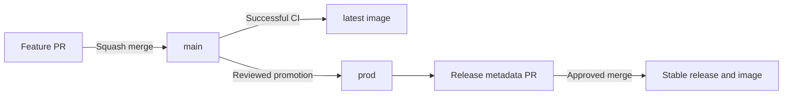

## Choose an image

| Tag | Use |
| --- | --- |
| `latest` | Tested builds from `main` |
| `vX.Y.Z` | A fixed stable release |

Set the image tag in your deployment Compose file. Follow the [deployment guide](/hosting/deployment) to start or update your server.

## Official publishing workflow

Contributors open PRs into `main`. Maintainers promote reviewed code to `prod`, approve release metadata, and publish the recorded commit.

`release-state` holds the changelog, version manifest, and the SHA of the approved production commit. Release metadata stays out of application branches. Release tags identify stable versions; the version in `app/package.json` is only for development.

Stable images are published for amd64 and arm64 after source, browser, container, and vulnerability checks. They do not change `latest`.

## PR titles

Use `<type>[(scope)][!]: 
` for PRs into `main`.

| Type | Version change |
| --- | --- |
| `feat:` | Minor |
| `fix:`, `perf:`, `revert:` | Patch |
| An accepted type with `!` | Major |
| `docs:`, `chore:`, `refactor:`, `test:`, `build:`, `ci:`, `style:`, `deps:` | Included with the next releasable change |

For example: `fix(relay): reject expired downloads`. The largest version bump required by commits since the last release determines the next version.

PRs into `main` use squash merges. Promotions to `prod` and metadata approvals use merge commits.

Maintainers: see [RELEASING.md](https://github.com/thesteau/evakage/blob/main/RELEASING.md) for repository setup, retries, and recovery.
