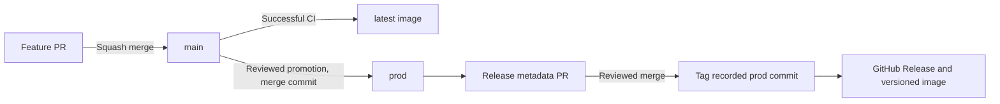

## Choosing an image

For self-hosting, use the [deployment setup](/hosting/deployment). `latest` follows
tested `main` builds; pin an available `vX.Y.Z` image tag for a stable version.
You do not need to run release automation to use Evakage or build your own fork.

## Maintainer publishing workflow

The following describes how this repository's maintainer publishes official images
and releases. Fork owners can choose their own publishing process.

`latest` belongs to `main`; stable releases use immutable `vX.Y.Z` tags.

`release-state` holds only the version manifest, changelog and recorded production
commit. Release metadata never merges into application branches. The first stable
release is `v1.0.0`. The development `package.json` version is not the stable release
source of truth; the tag and container OCI labels identify released code.

## PR titles and versions

Use `<type>[(scope)][!]: 
` for PRs into `main`, because squash merges use
the PR title as the commit message.

| Type | Version effect |
| --- | --- |
| `feat:` | Minor |
| `fix:`, `perf:`, `revert:` | Patch |
| Any accepted type with `!` | Major |
| `docs:`, `chore:`, `refactor:`, `test:`, `build:`, `ci:`, `style:`, `deps:` | No release on their own; included with the next releasable change |

For example, `fix(relay): reject expired downloads` produces a patch bump.
`feat(protocol)!: require a new handshake` produces a major bump. The largest
bump among unshipped commits determines the version.

Promotions into `prod` and approvals into `release-state` use merge commits.
Each release tags the production SHA recorded in the approved metadata, even if
newer work has reached `prod` while review was pending.

## Image versions

`latest` is published from successful `main` CI runs. Stable releases publish
`ghcr.io/thesteau/evakage:vX.Y.Z` for amd64 and arm64 after source, browser,
container smoke and vulnerability checks. Stable image retries skip existing tags.

Edit the image tag in the [deployment Compose file](/hosting/deployment) to pin
a published stable release. Stable releases do not move `latest`.

Maintainers: GitHub settings, retries and metadata recovery are covered
in [RELEASING.md](https://github.com/thesteau/evakage/blob/main/RELEASING.md).
